# ER Diagram — Sistema Empresarial

Diagrama completo de entidades. Sirve como **north star** para todas las migrations.

```mermaid
erDiagram
  %% ─── CORE ───────────────────────────────────────────────
  roles {
    uuid id PK
    varchar nombre
    int nivel
    text descripcion
    timestamp created_at
  }
  sucursales {
    uuid id PK
    varchar nombre
    text direccion
    jsonb horarios
    jsonb areas_internas
    bool activa
    timestamp created_at
  }
  usuarios {
    uuid id PK
    varchar nombre
    varchar email
    uuid rol_id FK
    uuid sucursal_id FK
    varchar estado_presencia
    text foto_url
    bool activo
    timestamp created_at
    timestamp updated_at
  }
  permisos_base {
    uuid id PK
    uuid rol_id FK
    varchar modulo
    varchar accion
    bool habilitado
  }
  permisos_usuario {
    uuid id PK
    uuid usuario_id FK
    varchar modulo
    varchar accion
    bool habilitado
    uuid modificado_por FK
    timestamp updated_at
  }

  %% ─── PRODUCTOS ──────────────────────────────────────────
  categorias {
    uuid id PK
    varchar nombre
    uuid padre_id FK
  }
  productos {
    uuid id PK
    varchar codigo
    varchar nombre
    uuid categoria_id FK
    text descripcion
    text foto_url
    bool activo
    timestamp updated_at
  }
  inventario {
    uuid id PK
    uuid producto_id FK
    uuid sucursal_id FK
    int cantidad
    int stock_minimo
    timestamp updated_at
  }
  movimientos_inventario {
    uuid id PK
    uuid producto_id FK
    uuid sucursal_id FK
    varchar tipo
    int cantidad
    uuid referencia_id
    varchar referencia_tipo
    uuid usuario_id FK
    timestamp created_at
  }
  mermas {
    uuid id PK
    uuid producto_id FK
    uuid sucursal_id FK
    int cantidad
    text motivo
    uuid registrado_por FK
    timestamp created_at
  }

  %% ─── PROVEEDORES ─────────────────────────────────────────
  proveedores {
    uuid id PK
    varchar nombre
    varchar contacto_nombre
    varchar contacto_tel
    varchar contacto_email
    bool activo
    timestamp created_at
  }
  pedidos_proveedor {
    uuid id PK
    uuid proveedor_id FK
    uuid sucursal_id FK
    varchar estado
    date fecha_solicitud
    date fecha_estimada
    date fecha_recepcion
    uuid creado_por FK
    timestamp created_at
  }
  items_pedido_proveedor {
    uuid id PK
    uuid pedido_id FK
    uuid producto_id FK
    int cantidad_solicitada
    int cantidad_recibida
  }

  %% ─── CLIENTES ────────────────────────────────────────────
  clientes_frecuentes {
    uuid id PK
    varchar nombre
    varchar telefono
    varchar email
    timestamp created_at
  }
  domicilios_cliente {
    uuid id PK
    uuid cliente_id FK
    varchar tipo
    text direccion
    bool predeterminado
  }
  datos_fiscales_cliente {
    uuid id PK
    uuid cliente_id FK
    varchar rfc
    varchar razon_social
    text direccion_fiscal
    varchar regimen_fiscal
    varchar uso_cfdi
  }

  %% ─── PEDIDOS VENTA ───────────────────────────────────────
  pedidos_venta {
    uuid id PK
    uuid sucursal_id FK
    uuid vendedora_id FK
    uuid cliente_id FK
    varchar estado
    timestamp created_at
    timestamp updated_at
  }
  items_pedido_venta {
    uuid id PK
    uuid pedido_id FK
    uuid producto_id FK
    int cantidad
    varchar estado_confirmacion
    uuid almacenista_id FK
    uuid sustituto_producto_id FK
    text observaciones
  }

  %% ─── FACTURACIÓN / PAQUETERÍAS ───────────────────────────
  facturas {
    uuid id PK
    uuid pedido_id FK
    uuid cliente_id FK
    text foto_ticket_url
    text foto_comprobante_url
    timestamp created_at
  }
  paqueterias {
    uuid id PK
    varchar nombre
    bool activa
  }
  envios {
    uuid id PK
    uuid pedido_id FK
    uuid cliente_id FK
    uuid domicilio_id FK
    uuid paqueteria_id FK
    text hoja_envio_url
    timestamp created_at
  }

  %% ─── PRECIOS / PROMOCIONES ───────────────────────────────
  precios_especiales {
    uuid id PK
    uuid producto_id FK
    uuid cliente_id FK
    decimal precio
    date vigencia_desde
    date vigencia_hasta
  }
  promociones {
    uuid id PK
    varchar nombre
    text descripcion
    varchar tipo
    decimal valor
    date inicio
    date fin
    bool activa
    uuid creado_por FK
  }

  %% ─── RRHH ────────────────────────────────────────────────
  empleados {
    uuid id PK
    uuid usuario_id FK
    date fecha_ingreso
    varchar tipo_contrato
    jsonb documentos
  }
  asistencia {
    uuid id PK
    uuid empleado_id FK
    date fecha
    time hora_entrada
    time hora_salida
    decimal horas_trabajadas
    decimal horas_extra
    varchar fuente
  }
  vacaciones {
    uuid id PK
    uuid empleado_id FK
    date fecha_inicio
    date fecha_fin
    varchar estado
    uuid aprobado_por FK
  }
  bonos {
    uuid id PK
    uuid empleado_id FK
    varchar periodo
    decimal monto
    text concepto
    timestamp created_at
  }
  llamadas_atencion {
    uuid id PK
    uuid empleado_id FK
    text motivo
    varchar tipo
    uuid registrado_por FK
    timestamp created_at
  }

  %% ─── CONTRATACIONES ─────────────────────────────────────
  candidatos {
    uuid id PK
    varchar nombre
    varchar email
    varchar telefono
    varchar puesto_aplicado
    uuid sucursal_id FK
    varchar estado
    timestamp created_at
  }
  entrevistas {
    uuid id PK
    uuid candidato_id FK
    uuid entrevistador_id FK
    text transcripcion
    text analisis_psicometrico
    decimal puntuacion
    timestamp realizada_at
  }

  %% ─── TAREAS ──────────────────────────────────────────────
  tareas {
    uuid id PK
    varchar titulo
    text descripcion
    uuid asignada_por FK
    uuid asignada_a FK
    uuid sucursal_id FK
    varchar estado
    timestamp fecha_limite
    timestamp created_at
    timestamp updated_at
  }
  subtareas {
    uuid id PK
    uuid tarea_id FK
    varchar titulo
    bool completada
  }
  evidencias_tarea {
    uuid id PK
    uuid tarea_id FK
    text url
    uuid subida_por FK
    timestamp created_at
  }
  comentarios_tarea {
    uuid id PK
    uuid tarea_id FK
    uuid usuario_id FK
    text contenido
    timestamp created_at
  }
  eventos_calendario {
    uuid id PK
    varchar titulo
    text descripcion
    uuid creado_por FK
    uuid sucursal_id FK
    timestamp inicio
    timestamp fin
    bool todo_el_dia
  }

  %% ─── COMUNICACIÓN ────────────────────────────────────────
  canales {
    uuid id PK
    varchar nombre
    varchar tipo
    uuid sucursal_id FK
    uuid creado_por FK
    timestamp created_at
  }
  miembros_canal {
    uuid canal_id FK
    uuid usuario_id FK
    timestamp joined_at
  }
  mensajes {
    uuid id PK
    uuid canal_id FK
    uuid usuario_id FK
    text contenido
    varchar tipo
    text archivo_url
    timestamp created_at
  }

  %% ─── SISTEMA ─────────────────────────────────────────────
  bitacora_actividad {
    uuid id PK
    uuid usuario_id FK
    varchar modulo
    varchar accion
    varchar metodo
    varchar ruta
    varchar ip
    jsonb datos
    timestamp created_at
  }
  notificaciones {
    uuid id PK
    uuid usuario_id FK
    varchar tipo
    varchar titulo
    text cuerpo
    jsonb datos
    bool leida
    timestamp created_at
  }
  avisos {
    uuid id PK
    varchar titulo
    text contenido
    uuid creado_por FK
    uuid sucursal_id FK
    bool global
    jsonb archivos
    timestamp created_at
  }

  %% ─── CAPACITACIÓN / EVALUACIONES ─────────────────────────
  cursos {
    uuid id PK
    varchar titulo
    text descripcion
    varchar tipo
    text url_contenido
    uuid creado_por FK
    bool activo
  }
  asignaciones_curso {
    uuid id PK
    uuid curso_id FK
    uuid usuario_id FK
    varchar estado
    int progreso_pct
    timestamp asignado_at
  }
  evaluaciones_desempeno {
    uuid id PK
    uuid evaluador_id FK
    uuid evaluado_id FK
    varchar tipo
    decimal puntuacion
    text comentarios
    timestamp created_at
  }

  %% ─── GARANTÍAS ───────────────────────────────────────────
  garantias_devoluciones {
    uuid id PK
    uuid pedido_id FK
    uuid cliente_id FK
    uuid producto_id FK
    varchar motivo
    varchar estado
    text resolucion
    timestamp created_at
  }

  %% ─── RELACIONES CLAVE ────────────────────────────────────
  usuarios ||--o{ permisos_usuario : "overrides"
  roles ||--o{ permisos_base : "defaults"
  roles ||--o{ usuarios : "tiene"
  sucursales ||--o{ usuarios : "pertenece"
  sucursales ||--o{ inventario : "tiene"
  productos ||--o{ inventario : "en"
  productos ||--o{ items_pedido_venta : "incluido"
  pedidos_venta ||--o{ items_pedido_venta : "contiene"
  clientes_frecuentes ||--o{ pedidos_venta : "realiza"
  clientes_frecuentes ||--o{ domicilios_cliente : "tiene"
  clientes_frecuentes ||--o{ datos_fiscales_cliente : "tiene"
  usuarios ||--o{ tareas : "asigna"
  usuarios ||--o{ mensajes : "envía"
  canales ||--o{ mensajes : "contiene"
  canales ||--o{ miembros_canal : "tiene"
  empleados ||--o{ asistencia : "registra"
  empleados ||--o{ bonos : "recibe"
```

## Notas de implementación

- Todas las tablas incluyen RLS habilitado
- `updated_at` manejado via trigger `set_updated_at()`
- `bitacora_actividad` es append-only (sin UPDATE/DELETE)
- `permisos_usuario` toma precedencia sobre `permisos_base`
- Campos `jsonb` para datos semi-estructurados (horarios, documentos, archivos)
